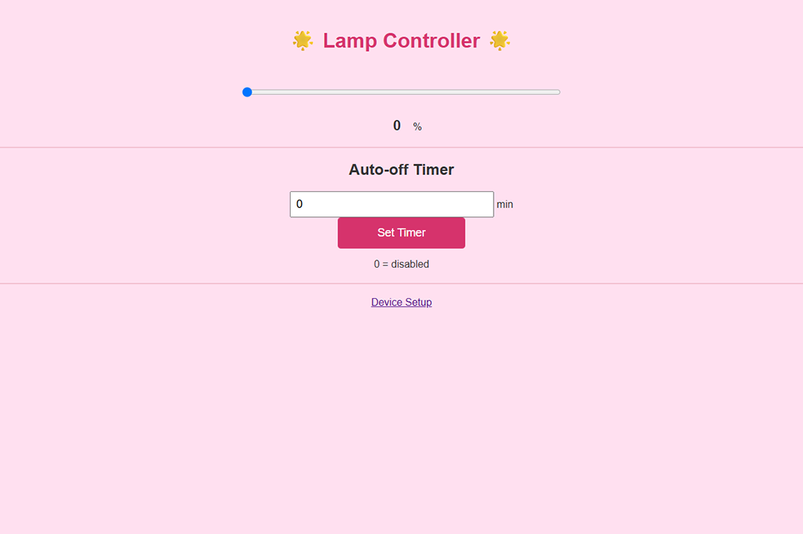
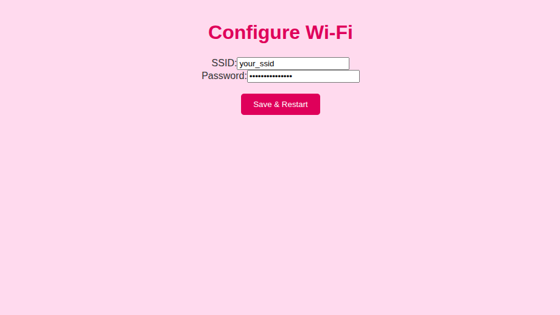
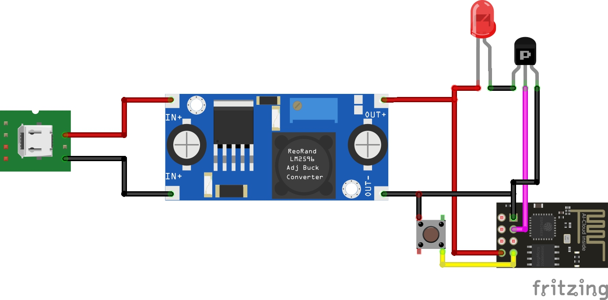

# ESP8266 Wi-Fi Lamp Controller

A simple yet flexible Wi-Fi-based lamp controller for ESP8266 microcontrollers (tested on ESP-01). Control an LED strip or lamp via your browser, using a PWM pin and an onboard toggle button.

This project is ideal for minimal ESP boards, like the ESP-01, where IO is limited but smart functionality is still desired.

---

## ✨ Features

- 🧠 **Smart Web Interface**  
  Access a user-friendly HTML UI to control lamp brightness and set an auto-off timer.

- 🌐 **Captive Portal Fallback**  
  If no Wi-Fi credentials are stored or connection fails, the ESP launches its own AP and captive portal.

* 📡 **Fully Offline Mode**
  Works entirely without internet access – you can control the lamp locally through the built-in Wi-Fi access point and web interface. Wi-Fi setup is optional.

- ⏲️ **Auto-Off Timer**  
  Set an optional timer to automatically turn off the lamp after a specified number of minutes.

- 🔘 **Physical Button Support**  
  Press the GPIO1 (TX pin) button to toggle between ON (100%) and OFF.

- 💡 **PWM Dimming**  
  Controls LED brightness through PWM on GPIO2.

- 🛠️ **Minimalist, Responsive UI**  
  Clean design and intuitive controls.

- 💾 **EEPROM Wi-Fi Credentials**  
  Credentials are stored in EEPROM, so the ESP reconnects automatically on reboot.

---

## 📷 Screenshots

Main Control Page | Wi-Fi Setup Page
:-------------------------:|:-------------------------:
 | 

---

## 🔌 Hardware Requirements

- **ESP8266 board** (tested on **ESP-01**)
- GPIO2 connected to PNP transistor or LED
- GPIO1 wired to a button (active LOW)
- 3.3V power supply (with enough current for Wi-Fi and LEDs)

---

## 🚀 Setup & Usage

### 1. Flash the Firmware
Upload the sketch using the Arduino IDE or PlatformIO. Make sure you've selected the correct board (e.g., `Generic ESP8266 Module` for ESP-01) and flashed the firmware.

### 2. First Boot / No Wi-Fi Configured

- The ESP will start in **Access Point (AP) mode** as `WiFi Lamp` with password `password123`
- Connect to it from your phone or laptop
- It should redirect automatically to the configuration page

    If not, navigate to [http://192.168.4.1/](http://192.168.4.1/)
- Enter your **Wi-Fi SSID and password**, then click **Save & Restart**

> ⚠️ **Note for ESP-01 users**: The ESP-01 cannot restart itself cleanly via software. After saving Wi-Fi credentials, manually **unplug and replug** the device to reboot into Station (STA) mode.

### 3. Normal Operation

- Once connected to your Wi-Fi, check your router for the ESP IP address, or use a tool like [Fing](https://www.fing.com/)
- Navigate to the IP in your browser
- Use the slider to adjust brightness
- Set a timer (in minutes) to automatically turn the lamp off after a period of time
- Use the button connected to GPIO1 to toggle ON/OFF quickly

---

### 🔌 Circuit Diagram

Below is the wiring diagram for the lamp, created in Fritzing. It shows how to connect the ESP8266 (tested on ESP-01), a PNP transistor for PWM control, and a button to toggle the lamp.

> 📁 You can find the editable `.fzz` project in [`assets/`](assets/esp8266_lamp.fzz).

## ⚙️ Web Interface Overview

- **Slider**: Controls lamp brightness (0–100%)
- **Auto-Off Timer**: Specify minutes after which the lamp will turn off automatically. Set to `0` to disable.
- **Wi-Fi Configuration**: Accessible from the main page via link or `/wifi`

---

## 📁 EEPROM Memory Layout

| Address | Purpose          | Max Length |
|---------|------------------|------------|
| 1       | Wi-Fi SSID       | 32 bytes   |
| 33      | Wi-Fi Password   | 64 bytes   |

---

## 🧼 Clearing EEPROM
To reset the stored Wi-Fi credentials, you can use the clear_eeprom sketch included in the repository. This will wipe the saved SSID and password, forcing the lamp to boot into Access Point mode on next startup.

## 🧪 Tested With

- **ESP-01** (ESP8266)
- 3.3V breadboard power supply
- PNP transistor circuit (BC557 or similar) to drive LED strip
- Basic button circuit with pull-up

---

## ❗ Known Limitations

- **ESP-01 can't reset itself** — manual power cycle needed after saving new Wi-Fi settings.
- Only two GPIOs are used (TX as button, GPIO2 as output).
- No HTTPS support in web UI.

---

## 📜 License

MIT License – feel free to use, adapt, and share this code with proper attribution.

---

## 💬 Feedback & Contributions

Pull requests, suggestions, or improvements are welcome!